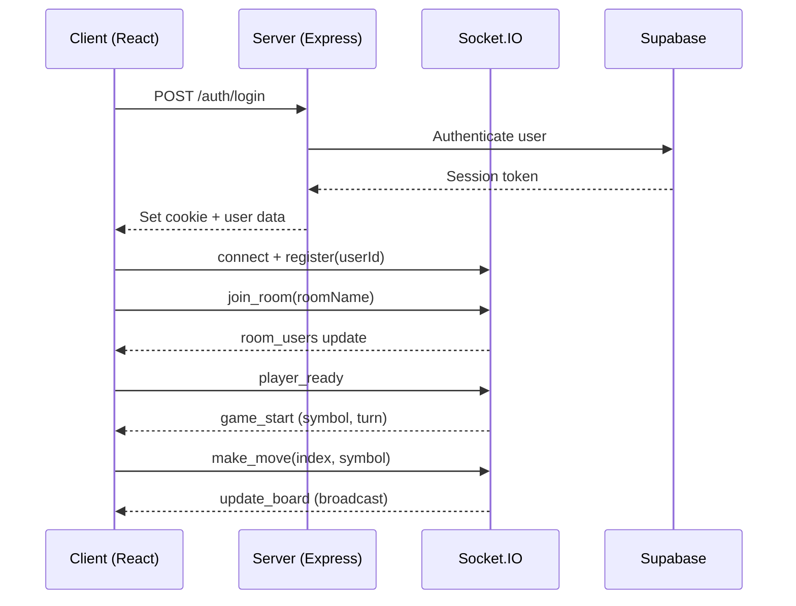

<div align="center">

# 🎮 Multiplayer Games

**A real-time multiplayer gaming platform built with React, Node.js, and Socket.IO**

[](https://www.typescriptlang.org/)
[](https://react.dev/)
[](https://socket.io/)
[](https://nodejs.org/)
[](https://supabase.com/)
[](https://tailwindcss.com/)

</div>

---

<!-- Add your own screenshots here:


-->

## Features

**Real-Time Multiplayer** — Play games with friends using WebSocket-powered communication and synchronization

**Authentication System** — Full signup/login flow with session cookies, plus guest access

**Friends System** — Send/accept/decline friend requests, manage your friends list, and invite them to games

**Live Chat** — In-game chat with auto-scrolling, system messages, and per-user color coding

**Dark UI** — Gradient accents, animations, and responsive mobile design

**Socket Resilience** — Auto-reconnection with exponential backoff, room cleanup, and state recovery

**Extensible Architecture** — Game registry pattern simplifies adding new games

## Architecture

```
Multiplayer-Games/
├── client/                    # React frontend (Vite + Tailwind CSS 4)
│   ├── src/
│   │   ├── components/        # UI components (AuthPage, Header, GamesList, FriendsList)
│   │   ├── context/           # AuthContext for global auth state
│   │   ├── hooks/             # Custom hooks (useSocket, useGameRoom, useFriends)
│   │   ├── games/             # Game registry (extensible game configs)
│   │   ├── types.ts           # Shared TypeScript interfaces
│   │   └── config.ts          # Environment-based API URL
│   └── netlify.toml           # Netlify deployment config
│
└── server/                    # Node.js backend (Express + Socket.IO)
    └── src/
        ├── routes/            # REST API (auth.ts, friends.ts)
        ├── socket/            # WebSocket handlers (handlers.ts)
        ├── config/            # Supabase client setup
        └── server.ts          # Express + Socket.IO initialization
```

### Data Flow



## Quick Start

### Prerequisites

- **Node.js** ≥ 18
- **npm** ≥ 9
- A **Supabase** project (https://supabase.com/)

### 1. Clone & Install

```bash
git clone https://github.com/krz-sta/Multiplayer-Games.git
cd Multiplayer-Games

# Install dependencies for both client and server
cd client && npm install && cd ..
cd server && npm install && cd ..
```

### 2. Configure Environment

```bash
# Server
cp server/.env.example server/.env
# Edit server/.env with your Supabase credentials

# Client (optional — defaults to localhost:3001)
cp client/.env.example client/.env
```

**Server `.env`:**
| Variable | Description |
|----------|-------------|
| `SUPABASE_URL` | Your Supabase project URL |
| `SUPABASE_KEY` | Supabase service role key |
| `CLIENT_URL` | Frontend URL for CORS (`http://localhost:5173` for dev) |
| `PORT` | Server port (default: `3001`) |

### 3. Database Setup

Create a `profiles` table and a `friendships` table in your Supabase project:

```sql
create table profiles (
  id uuid primary key references auth.users(id) on delete cascade,
  username text unique not null
);

create table friendships (
  id serial primary key,
  sender_id uuid references profiles(id) on delete cascade,
  receiver_id uuid references profiles(id) on delete cascade,
  status text check (status in ('pending', 'accepted')) default 'pending',
  created_at timestamptz default now()
);
```

### 4. Run

```bash
# Terminal 1 — Server
cd server && npm run dev

# Terminal 2 — Client
cd client && npm run dev
```

Open **http://localhost:5173** and start playing!

## Tech Stack

| Layer | Technology | Purpose |
|-------|-----------|---------|
| **Frontend** | React 19, TypeScript, Vite | UI framework with fast HMR |
| **Styling** | Tailwind CSS 4 | Utility-first CSS with dark theme |
| **State** | React Context + Custom Hooks | Auth state, socket management, game logic |
| **Real-time** | Socket.IO Client | WebSocket connection with auto-reconnect |
| **Backend** | Express 5, TypeScript | REST API for auth & friends |
| **WebSockets** | Socket.IO Server | Game events, chat, invites |
| **Database** | Supabase (PostgreSQL) | User auth, profiles, friendships |
| **Auth** | Supabase Auth + HTTP-only cookies | Secure session management |

## Adding New Games

The project uses a **game registry pattern** — adding a new game is straightforward:

```typescript
// client/src/games/registry.ts
export const gameRegistry: GameConfig[] = [
    {
        id: 'tictactoe',
        name: 'Tic-Tac-Toe',
        description: 'Classic 3x3 grid game. Get three in a row to win!',
        minPlayers: 2,
        maxPlayers: 2,
        icon: '❌⭕',
    },
    // Add your game here:
    {
        id: 'connect4',
        name: 'Connect Four',
        description: 'Drop discs to connect four in a row.',
        minPlayers: 2,
        maxPlayers: 2,
        icon: '🔴🟡',
    },
];
```

Then create the corresponding game component and socket handlers.

## Deployment

| Service | Platform | Config |
|---------|----------|--------|
| **Server** | [Render](https://render.com) | Root: `server`, Build: `npm install && npm run build`, Start: `npm start` |
| **Client** | [Netlify](https://netlify.com) | Base: `client`, Build: `npm run build`, Publish: `client/dist` |

> Set `VITE_API_URL` on Netlify → your Render URL  
> Set `CLIENT_URL` on Render → your Netlify URL

## License

This project is open source and available under the [MIT License](LICENSE).
